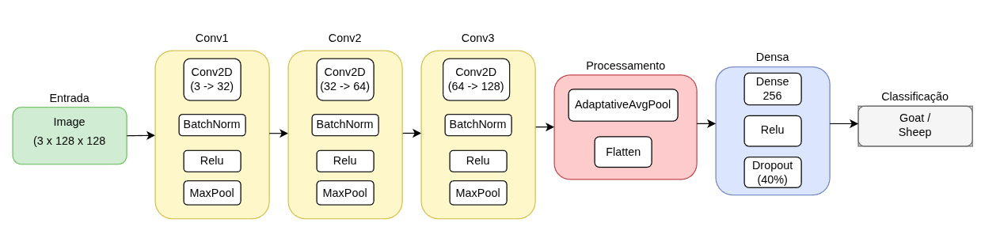
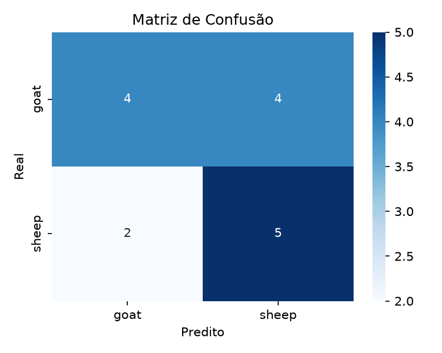
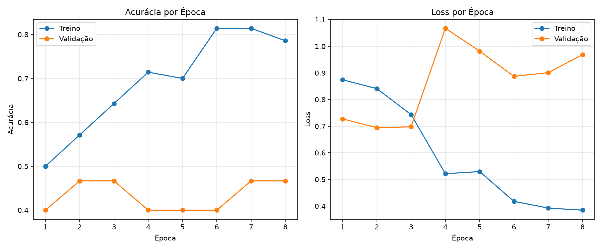

# 🐐🐑 Goat Sheep CNN Classifier

<p align="center">


</p>


## 📌 Sobre o projeto

Sistema de Visão Computacional baseado em uma **Rede Neural Convolucional (CNN)** desenvolvida em **PyTorch** capaz de classificar imagens de animais entre:

- 🐐 Goat (Caprino)
- 🐑 Sheep (Ovinos)


O objetivo é estudar e aplicar técnicas de Deep Learning para classificação de imagens no contexto de agropecuária, podendo servir como base para:

- identificação automática de animais;
- sistemas inteligentes de gerenciamento de rebanhos;
- aplicações móveis para produtores;
- monitoramento automatizado.


---

## 🎬 Demonstração

<p align="center">


</p>


Exemplo de funcionamento:

```
Imagem → CNN → Probabilidade → Classe prevista
```


---

# 🧠 Arquitetura do Modelo





### Características

✔ CNN criada em PyTorch  
✔ Sem transferência de aprendizado  
✔ Batch Normalization  
✔ Dropout contra overfitting  
✔ BCEWithLogitsLoss  
✔ Early stopping  
✔ Scheduler de aprendizado  


---

# 📂 Estrutura do projeto


```
goat-sheep-cnn-classifier/
│
├── dataset/
│   │
│   ├── goat/
│   │   ├── img001.jpg
│   │   └── ...
│   │
│   └── sheep/
│       ├── img001.jpg
│       └── ...
│
├── src/

│   ├── train_model.py
│   ├── test_model.py
│

├── results/

│   ├── confusion_matrix.png
│   ├── training_history.png


├── models/

│   └── cnn_goat_sheep.pth


├── requirements.txt

└── README.md

```


---

# 📊 Dataset


Formato utilizado:

```
ImageFolder
```

Organização:

```
dataset/

├── goat/
│   └── imagens de caprinos

└── sheep/
    └── imagens de ovinos
```


Classes:

| Classe | Label |
|-|-|
| Goat | 0 |
| Sheep | 1 |


Divisão:


| Dataset | Percentual |
|-|-|
| Treino | 70% |
| Validação | 15% |
| Teste | 15% |

---

# ⚙️ Instalação


## 1. Clonar o repositório


```bash
git clone https://github.com/raislan-italo/goat-sheep-cnn-classifier.git
```


Entrar na pasta:


```bash
cd goat-sheep-cnn-classifier
```


---

## 2. Criar ambiente virtual


Linux / Mac:


```bash
python3 -m venv venv
```


Ativar:


```bash
source venv/bin/activate
```


Windows:


```bash
python -m venv venv
```


Ativar:


```bash
venv\Scripts\activate
```


---

## 3. Atualizar pip


```bash
python -m pip install --upgrade pip
```


---

## 4. Instalar dependências


```bash
pip install -r requirements.txt
```


---

# 📦 Dependências


Arquivo `requirements.txt`:


```
torch
torchvision
numpy
pandas
matplotlib
seaborn
scikit-learn
tqdm
pillow
```


---

# 📁 Estrutura do Dataset

```
dataset/

├── goat/

└── sheep/
```
---

# 🚀 Treinamento


Executar:


```bash
python src/train_model.py
```


Durante o treinamento será exibido:


```
Epoch 10/30

TRAIN
Loss: 0.124


VALIDATION

Loss: 0.215
Accuracy: 0.90

```


Ao finalizar serão gerados:


```
results/

├── training_history.png
├── confusion_matrix.png
└── metrics.csv
```


E o modelo:


```
models/cnn_goat_sheep.pth
```


---

# 🔎 Testar uma nova imagem


Executar:


```bash
python src/test_model.py imagem.jpg
```


Exemplo:


```bash
python src/test_model.py dataset/goat/goat7.jpg
```


Saída:


```
Imagem analisada:

goat7.jpg


Predição:

Classe: Goat

Confiança:
96.8%

```


---

# 📈 Métricas avaliadas


O projeto calcula:


| Métrica | Descrição |
|-|-|
| Accuracy | Taxa geral de acerto |
| Precision | Acertos positivos |
| Recall | Capacidade de encontrar classe |
| F1-score | Média harmônica |
| AUC | Área da curva ROC |


Exemplo:


```
Accuracy : 0.90

Precision: 0.91

Recall   : 0.89

F1-score : 0.90

AUC      : 0.94
```


---

# 📊 Resultados


<p align="center">





</p>


---

# 🔬 Tecnologias utilizadas


- Python
- PyTorch
- Torchvision
- NumPy
- Pandas
- Scikit-learn
- Matplotlib


---

# 🔮 Trabalhos futuros


- Transfer Learning com:
  - ResNet18
  - MobileNetV2
  - EfficientNet


- Dataset maior com diferentes raças

- Deploy em:

  - Raspberry Pi
  - ESP32-CAM
  - Aplicativo mobile


---

# 👨‍💻 Raislan Ítalo


Projeto desenvolvido para estudo de:

**Visão Computacional + Redes Neurais Convolucionais**

```