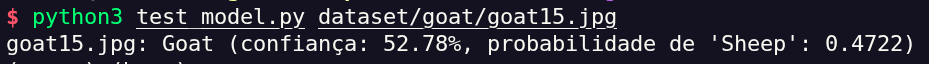

# 🐐🐑 Goat Sheep CNN Classifier

<p align="center">


</p>

## 📌 Sobre o Projeto

Sistema de Visão Computacional baseado em uma **Rede Neural Convolucional (CNN)** desenvolvida em **PyTorch**, capaz de classificar imagens de animais entre:

- 🐐 **Goat** (Caprino)
- 🐑 **Sheep** (Ovino)

O objetivo é estudar e aplicar técnicas de Deep Learning para classificação de imagens no contexto da agropecuária, podendo servir como base para:

- identificação automática de animais;
- sistemas inteligentes de gerenciamento de rebanhos;
- aplicações móveis para produtores;
- monitoramento automatizado no campo.

---

## 🎬 Demonstração

<p align="center">

</p>

Fluxo de funcionamento:

```
Imagem → CNN → Probabilidade (sigmoid) → Classe prevista (Goat ou Sheep)
```

---

## 🧠 Arquitetura do Modelo


### Características

✔ CNN construída do zero em PyTorch (sem transfer learning)
✔ 3 blocos convolucionais (Conv2D → BatchNorm → ReLU → MaxPool)
✔ Adaptive Average Pooling (independe do tamanho da imagem de entrada)
✔ Dropout (0.4) contra overfitting
✔ `BCEWithLogitsLoss` (classificação binária)
✔ Otimizador Adam + `ReduceLROnPlateau`
✔ Early stopping (paciência de 6 épocas)
✔ Checkpoint automático do melhor modelo (baseado na menor `val_loss`)

---

## 📂 Estrutura do Projeto

```
goat-sheep-cnn-classifier/
│
├── dataset/
│   ├── goat/
│   │   ├── img001.jpg
│   │   └── ...
│   └── sheep/
│       ├── img001.jpg
│       └── ...
│
├── models/
│   └── cnn_goat_sheep.pth
│
├── results/
│   ├── confusion_matrix.png
│   ├── training_history.png
│   └── metrics.csv
│
├── train_model.py
├── test_model.py
├── requirements.txt
└── README.md
```

---

## 📊 Dataset

**Fonte:** [sheep_goat](https://www.kaggle.com/datasets/khotijahs1/sheep-goat) (Kaggle, Khotijah, 2020)
**Formato:** `torchvision.datasets.ImageFolder`
**Tamanho aproximado:** ~100 imagens no total

```
dataset/
├── goat/
│   └── imagens de caprinos
└── sheep/
    └── imagens de ovinos
```

| Classe | Label |
|---|---|
| Goat | 0 |
| Sheep | 1 |

**Divisão dos dados:**

| Conjunto | Percentual |
|---|---|
| Treino | 70% |
| Validação | 15% |
| Teste | 15% |

---

## ⚙️ Instalação

**1. Clonar o repositório**
```bash
git clone https://github.com/raislan-italo/goat-sheep-cnn-classifier.git
cd goat-sheep-cnn-classifier
```

**2. Criar ambiente virtual**

Linux / Mac:
```bash
python3 -m venv venv
source venv/bin/activate
```

Windows:
```bash
python -m venv venv
venv\Scripts\activate
```

**3. Atualizar pip**
```bash
python -m pip install --upgrade pip
```

**4. Instalar dependências**
```bash
pip install -r requirements.txt
```

### 📦 Dependências (`requirements.txt`)

```
torch
torchvision
numpy
pandas
matplotlib
seaborn
scikit-learn
tqdm
pillow
```

---

## 🚀 Treinamento

```bash
python train_model.py
```

Durante o treinamento é exibido, a cada época:

```
Epoch 10/30

TRAIN
Loss: 0.124

VALIDATION
Loss: 0.215
Accuracy: 0.90
```

Ao finalizar, são gerados automaticamente:

```
results/
├── training_history.png
├── confusion_matrix.png
└── metrics.csv
```

E o modelo treinado:

```
models/cnn_goat_sheep.pth
```

---

## 🔎 Testar uma Nova Imagem

```bash
python test_model.py caminho/da/imagem.jpg
```

Exemplo:
```bash
python test_model.py dataset/goat/goat7.jpg
```

Saída:
```
Imagem analisada: goat7.jpg

Predição: Goat
Confiança: 96.8%
```

---

## 📈 Métricas Avaliadas

| Métrica | O que significa |
|---|---|
| **Accuracy** | Taxa geral de acerto do modelo |
| **Precision** | Dos que o modelo previu como positivos, quantos realmente eram |
| **Recall** | Dos que realmente eram positivos, quantos o modelo encontrou |
| **F1-score** | Média harmônica entre Precision e Recall |

---

## 📊 Resultados

<p align="center">


</p>

### Métricas gerais (conjunto de teste)

| Métrica | Valor |
|---|---|
| Accuracy | 67% |
| Precision | 62% |
| Recall | 71% |
| F1-score | 67% |

### Métricas por classe

| Classe | Precision | Recall | F1-score | Suporte |
|---|---|---|---|---|
| 🐐 Goat | 71% | 62% | 67% | 8 |
| 🐑 Sheep | 62% | 71% | 67% | 7 |

O modelo apresentou desempenho equilibrado entre as duas classes, sem viés sistemático em favor de nenhuma delas — a matriz de confusão mostra 3 caprinos confundidos com ovinos e 2 ovinos confundidos com caprinos, erros distribuídos em ambas as direções. As curvas de treino/validação, no entanto, evidenciam **overfitting**: a acurácia de treino chega a 83% enquanto a validação oscila entre 40-60%, reflexo direto do tamanho reduzido do dataset (apenas 15 amostras no conjunto de teste).

---

## 🔬 Tecnologias Utilizadas

- Python
- PyTorch / Torchvision
- NumPy / Pandas
- Scikit-learn
- Matplotlib / Seaborn

---

## 🔮 Trabalhos Futuros

- **Transfer Learning** com ResNet18, MobileNetV2 ou EfficientNet
- **Dataset maior**, incluindo diferentes raças de caprinos e ovinos
- **Validação cruzada (k-fold)**, para estimativas mais robustas dado o tamanho reduzido do dataset atual
- **Deploy** em:
  - Raspberry Pi
  - ESP32-CAM
  - Aplicativo mobile

---

## 👨‍💻 Autor

**Raislan Ítalo**

Projeto desenvolvido para estudo de **Visão Computacional + Redes Neurais Convolucionais**.
